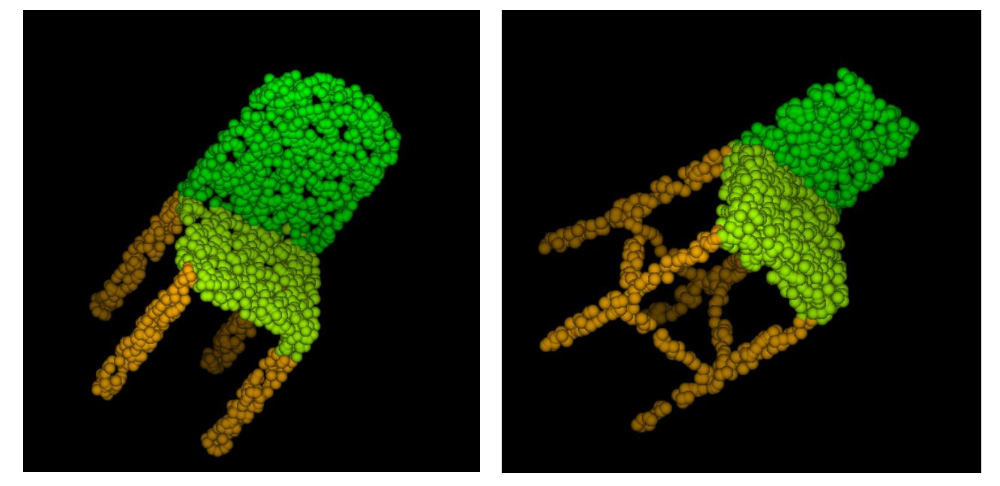
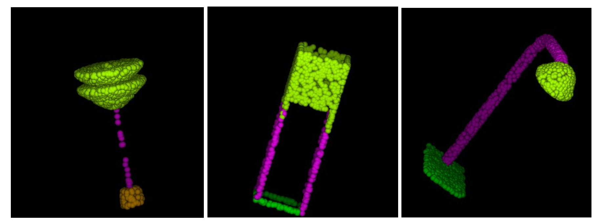

# PointNet
A deep neural network for the classification and segmentation of 3D object. The implementation is done as per the original paper:
https://arxiv.org/pdf/1612.00593.pdf

Data used: https://shapenet.cs.stanford.edu/ericyi/shapenetcore_partanno_segmentation_benchmark_v0.zip

Below are the results for segmentation:

